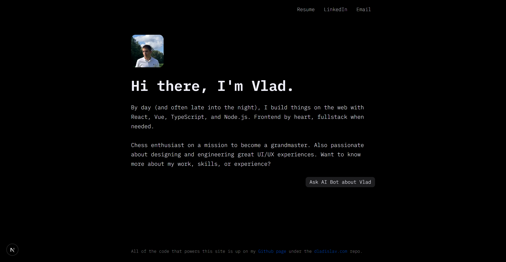

# dladislav.com Monorepo


[](LICENSE)
[](https://github.com/dladislav201/dladislav.com/actions/workflows/ci.yml)
[](https://dladislav.com)

> Personal portfolio website monorepo.

[Live Website](https://dladislav.com)



## Project Structure

```
dladislav.com/
├── web/ # Next.js frontend
├── server/ # Node.js backend
├── LICENSE
└── README.md
```

## Tech Stack

#### Frontend

- [Next.js](https://nextjs.org/)
- [TypeScript](https://www.typescriptlang.org/)

#### Backend

- [Node.js]
- [Express]
- [TypeScript](https://www.typescriptlang.org/)
- [OpenAI API Integration](https://platform.openai.com/docs/api-reference)
- [Pinecone](https://www.pinecone.io/)
- [Jest](https://jestjs.io/)

## Workspaces

- `web/`: Frontend portfolio website
- `server/`: Backend API and services

## Getting Started

### Prerequisites

- Node.js (version 18 or later)
- npm

### Installation

1. Clone the repository

`s

2. Install dependencies

```bash
npm install
# or
yarn
```

## Available Scripts

- `npm run dev:web` - Start frontend development server
- `npm run dev:server` - Start backend development server
- `npm run build` - Build all projects
- `npm run test` - Run all tests

## License

This project is licensed under the MIT License - see the [LICENSE](LICENSE) file for details.

## Contact

Vladyslav Dobrodii - [dobrodii.vlad200@gmail.com](mailto:dobrodii.vlad200@gmail.com)
Project Link: [https://github.com/dladislav201/dladislav.com](https://github.com/dladislav201/dladislav.com)
